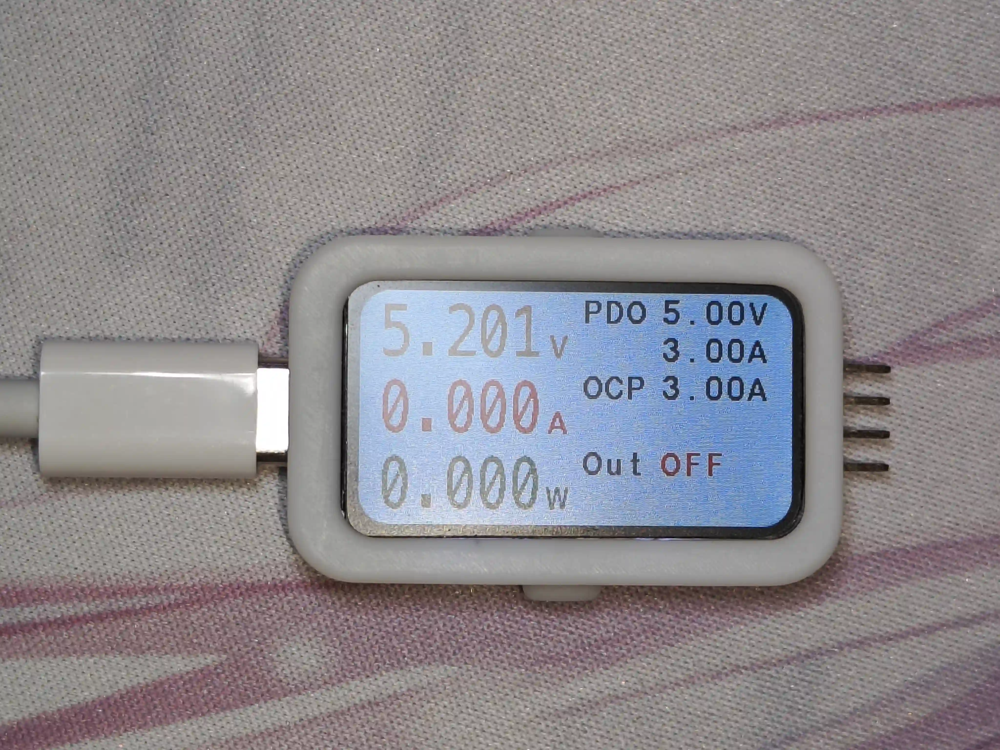

# VoltageSpy

## Project Overview

VoltageSpy is a versatile power analysis tool, integrating a USB-PD (Power Delivery) emulator and real-time current, voltage, and power display functionality.

Originally intended for testing my other USB-C power project, this device can also serve as a temporary power supply tool. It supports voltage requests of 5V, 9V, 12V, 15V, 18V, and 20V.

The project is currently functional, but there are some additional features that I haven't had time to implement yet.

## Key Features

1. **PD Emulator**: Simulates various PD devices for testing and developing USB-C PD chargers and devices.
2. **Real-Time Display**: High-precision real-time monitoring and display of current, voltage, and power data.
3. **Overcurrent Protection**: Supports software overcurrent protection.
4. **Multi-Protocol Support**: In addition to PD, it also supports QC (Quick Charge) and other fast-charging protocols.

TODO:

- [ ] PWM Output
- [ ] Settings Memory (considering adding an EEPROM to achieve this)

## Technical Specifications

- Input Voltage Range: 0-20V
- Current Measurement Range: 0-5A
- Power Measurement Range: 0-100W
- Display: 1.47-inch TFT display (ST7789)
- Interface: USB-C -> 2.54mm pitch pin header
- Dimensions: 46mm x 26mm x 8.5mm

- Main Controller: STM32G071GBU6
- PD Sink Chip: HUSB238
- Current Sensor: INA226

- Firmware developed with Rust + embassy-stm32
